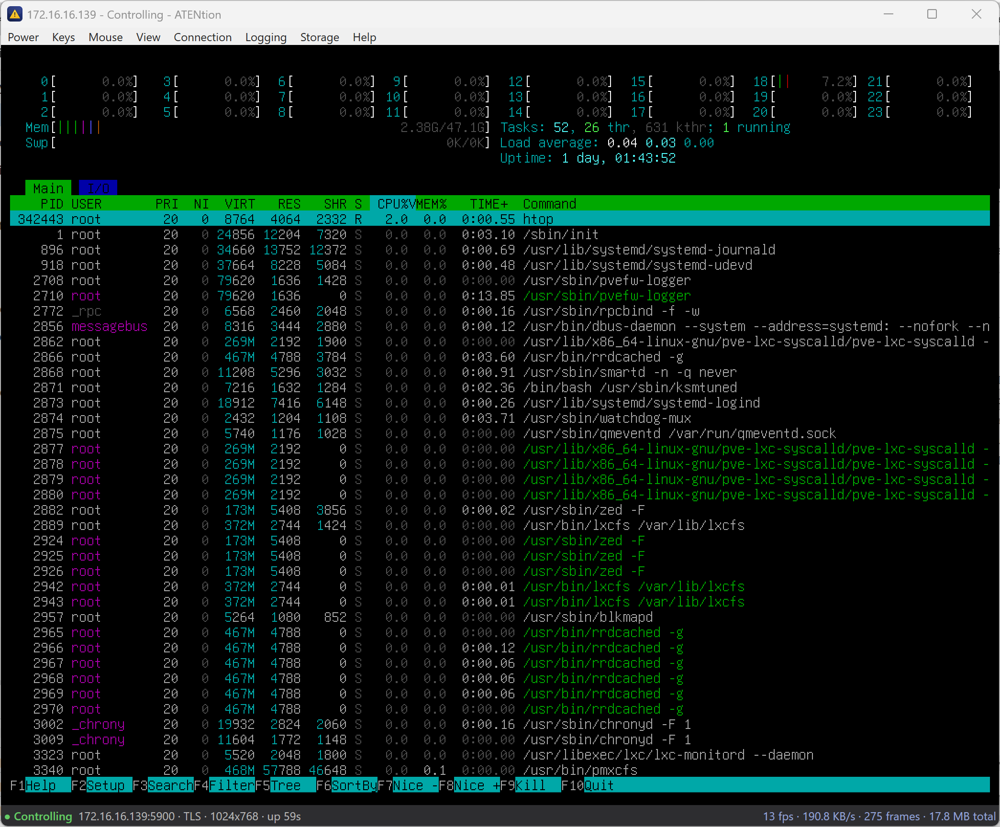

# ATENtion

A fast, native Windows console (KVM-over-IP) client for Supermicro servers with
ATEN/Pilot BMCs. It is a from-scratch replacement for the old Java iKVM viewer.




## Why this exists

If you run an older Supermicro board, the only console option the BMC hands you is the
ATEN Java iKVM viewer, launched through Java Web Start. That path has aged badly:

- Java Web Start and `javaws` were removed from modern JDKs, so the launcher often does
  not run at all without an old JRE or OpenWebStart.
- Every session is a fresh `.jnlp` file full of single-use tokens that expire, so you
  re-download it from the web UI each time.
- You click through Java security prompts on every launch (assuming you've modified 
  `java.security` correctly to even permit clicking through).
- The viewer is clunky, and the bundled TLS certificates have since expired,
  which breaks the connection outright on a correct clock.

ATENtion skips all of that. It speaks the ATEN protocol directly as a native
application, so there is no Java, no Web Start, and no `.jnlp` juggling. Enter the BMC
address and credentials and you are on the console.

## Status and tested hardware

This has been tested on one board thus far: my **Supermicro X9DRH-7F** (X9 generation, 
with an ATEN/Pilot BMC). Other ATEN/Pilot-based Supermicro BMCs across the X9, X10, and 
X11 generations should work, but they are presently untested.

## Features

- Live video, keyboard, and mouse over the console.
- Mouse in Absolute mode (the pointer mode BIOS, UEFI, and most operating systems expect).
- Power control: On, Off, Reset, and Soft Off (ACPI), plus Ctrl+Alt+Del.
- Virtual media: mount a local `.iso` as a read-only CD-ROM, by menu or by dragging the
  file onto the video.
- Screenshots of the current frame, saved as PNG.
- Paste the clipboard into the host as keystrokes.
- Send-key macros: Alt+Tab, Alt+F4, Alt+Space, Ctrl+Esc, the Windows key, Print Screen,
  and any arbitrary custom combination.
- View options: fullscreen, fit-to-window, actual size (1:1), and smooth or crisp scaling.
- Auto-reconnect after a dropped link.
- A live Session Info panel (endpoint, transport, resolution, control state, frame rate,
  throughput, uptime).
- Optional diagnostic logging, off by default.
- ASPEED AST2400/AST2500 modified-JPEG video (`RFB encoding 0x57`), including
  differential updates.
- A command-line screenshot client for unattended diagnostics.

## Requirements

- Windows 10 or later (may work on earlier - untested).
- .NET Framework 4.8.

## Build

With the .NET SDK:

```
dotnet build ATENtion.slnx -c Release
```

The application is produced at `src/ATENtion.App/bin/Release/net48/ATENtion.exe`.
Visual Studio 2022 also opens and builds `ATENtion.slnx` directly.

## Connecting

There are two ways to connect. The Connect dialog gates its fields based on the
"Arm via web" checkbox.

- **Auto-arm (recommended).** Leave "Arm via web" ticked and enter the BMC web user name
  and password. The app logs into the BMC, acquires a fresh single-use session token, and
  picks the port and TLS setting for you.
- **Manual token.** Untick "Arm via web", then paste a session token and set the port and
  TLS yourself. This is for when you already hold a token or do not want the app to log
  in to your BMC.

If the first connection fails with a TLS or certificate error, that is expected on many
boards. See the FAQ entry on the expired certificate below.

## How it works

ATENtion is a native client for the ATEN variant of the RFB/VNC protocol that Supermicro
iKVM uses. It connects with mutual TLS to the BMC KVM port (5900 by default), or in plain
text to the iKVM port (63630) when KVM SSL is turned off on the BMC. Video, input, power,
and virtual media all utilise the same connection.

## Project layout

- `src/ATENtion.Core` - the protocol, video codec, input, crypto, and virtual-media logic.
- `src/ATENtion.App` - the WPF application and its windows.
- `src/ATENtion.Capture` - the command-line login and screenshot client.
- `src/ATENtion.Aspeed.Native` - ASPEED's MPL-2.0 reference decoder and Windows x64 DLL.
- `tests/ATENtion.Tests` - the unit tests.

## License

The application is MIT licensed; see [LICENSE](LICENSE). The ASPEED reference-decoder
files are MPL-2.0; see `src/ATENtion.Aspeed.Native/LICENSE`.

---

## FAQ

### The connection fails with a TLS handshake or certificate error. What now?

The client certificate Supermicro bundles with iKVM has expired (around mid-2026), so a
TLS handshake on a correctly-set clock is refused. Two ways around it:

1. **Roll the BMC clock back.** In the BMC web UI, under Configuration > Date and Time,
   set the date to before the client-certificate expiry (for example 2024), then reconnect.
   This workaround changes the BMC clock, not the Windows or WSL clock. It is required
   only when the BMC rejects the mutual-TLS client certificate as expired.
2. **Disable KVM SSL on the BMC.** Turn off SSL/encryption for the KVM console in the BMC
   web UI. The BMC then serves the plain-text iKVM port (63630) and no certificate is
   involved. ATENtion connects to it directly.

You can also drop a renewed `client.pfx` next to `ATENtion.exe`. A certificate file found
beside the executable overrides the one built into the application.

### Auto-arm or token mode, and why?

Auto-arm is the easy path. You give the app your BMC web user name and password, it logs
in, fetches a fresh single-use token, and reads the correct port and TLS setting from the
BMC. Token mode is for when you already have a session token (for example from a `.jnlp`
you downloaded) or you do not want the app to log in for you; you then set the port and
TLS by hand. Because tokens are single-use and expire quickly, auto-arm is less trouble.

### Which port, and TLS or plain text?

By default the console is mutual TLS on port 5900. If KVM SSL is disabled on the BMC, it
is plain text on port 63630 instead. In auto-arm mode the app chooses automatically based
on the BMC's stunnel setting. In token mode you choose.

### The mouse does not track properly.

Only Absolute pointer mode is implemented. That is the mode BIOS, UEFI, and most operating
systems use, so it covers the common cases. Relative and Single modes are not done yet.

### How do I mount an ISO?

Use Storage > Mount ISO, or drag an `.iso` file onto the video. It appears to the host as
a read-only CD-ROM. Unmount it from the Storage menu. This has been a bit buggy for me, so
please raise an issue if you encounter any issues.

### Where are my settings and BMC password stored?

In `user.config` under `%LOCALAPPDATA%`. The BMC password is protected with DPAPI scoped
to your Windows user, never stored in the clear.

### What is in the log file, and is it safe to share?

Logging is off by default. Passwords, JNLP credentials, cookies, and CSRF tokens are
redacted. A log can still contain your BMC IP address, hostname, account name, client IP,
and console metadata, so review it before sharing. The repository ignores `*.log`.

### Will it work on my board?

It has only been verified on the X9DRH-7F. Other ATEN/Pilot-based Supermicro BMCs should
work, but they are untested.

### I am connected but the screen is black.

Use View > Refresh Screen. The real resolution is negotiated from the first video frame,
so a refresh forces the BMC to send another full frame.

### How do I capture a screenshot from the command line?

The packaged `ATENtion.Capture.exe` companion logs in, starts the video stream, and saves
the first decoded frame as a BMP without opening the GUI:

```powershell
.\ATENtion.Capture.exe --host 10.8.54.20 --user admin --output console.bmp
```

It prompts for the BMC password without echoing it. To retain the exact first raw ASPEED
packet alongside the screenshot, add `--raw-output packet.bin`. The GUI also
writes one bounded `ATENtion-unsupported-frame.bin` when diagnostic logging is enabled.
Screenshots and raw packets contain remote-console pixels, so treat them as sensitive.
